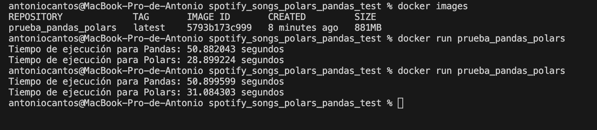

# Pandas vs Polars con dataset de canciones de Spotify

La idea de este repositorio es ver el tiempo de ejecución de las librerías Pandas y Polars de Python.
Para ello he utilizado un dataset de canciones de Spotify, que se puede encontrar en [Kaggle](https://www.kaggle.com/datasets/asaniczka/top-spotify-songs-in-73-countries-daily-updated).
En vez de leer el fichero en local, lo he almacenado en un Storage Account de Azure.
Para poder utilizar el código, primero es necesario crear un fichero de variables de entorno **.env**.
En este fichero tendremos tanto el nombre del storage como la key.

Resultados tras ejecutar tres veces el contenedor donde se ejecuta el código:

